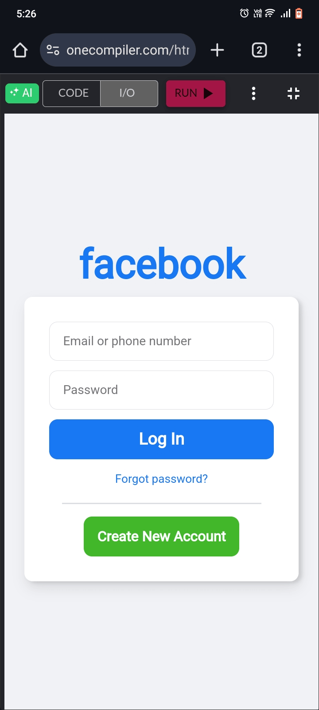

# Fake Login Page (For Educational Purposes Only)

This is a simulated login page created **strictly for educational purposes only**. It is designed to help learners understand how phishing attacks work and how to prevent them. This project does **not** target any specific website or service, and **must not** be used for malicious activities.

## the page looks like:

## Features
- Simple HTML/CSS login form
- Logs entered username and password (for local test only)
- Can be hosted on localhost using tools like XAMPP, WAMP, or Python HTTP server

## Disclaimer
This project is intended for **ethical hacking training**, awareness programs, and **cybersecurity education** only.

**Do not use this project to impersonate real websites like Facebook, Google, etc.**

Using this for illegal activities is strictly prohibited and may lead to **criminal prosecution**.

## How to Run
1. Clone the repository
2. Open `index.html` in a browser or serve it via localhost
3. Enter any dummy data to see how data can be captured (for educational use only)

## License
MIT License (for educational use)
